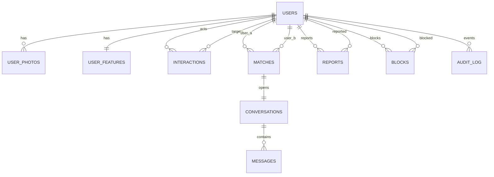
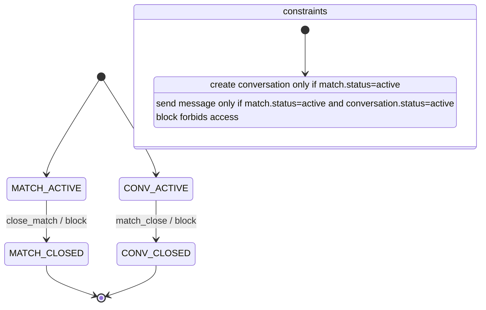

# T-Match Backend

README — основная точка входа в backend. Здесь описано: архитектура, модель данных, переходы состояний, основной сценарий, API и тестирование.

## 1. Кратко: что решает backend
Backend отвечает за:
- выдачу рекомендаций и объяснений совпадений;
- обработку действий пользователей (like/skip/hide), создание мэтчей;
- запуск и поддержку чатов после мэтча;
- безопасность (репорты, блокировки, анти‑абьюз лимиты);
- аудит ключевых событий.

## 2. Архитектура
Компоненты (docker‑compose):
- `app` — FastAPI backend (основной API, бизнес‑логика, анти‑абьюз, аудит, админ‑функции).
- `ml` — FastAPI сервис ранжирования (`/rank`).
- `db` — Postgres.
- `redis` — кэш объяснений и дневные лимиты.
- `llm` — локальный llama‑cpp‑python (Qwen) для генерации объяснений (опционально, профиль `gpu`).
- `admin_frontend` — статичная админ‑панель.

Взаимодействие (упрощённо):
- Клиент → `app` → Postgres/Redis/ML → ответ.
- `app` → `llm` (опционально) → объяснение → Redis.
- Админка → `app` (репорты/блок/аудит).

Подробнее по ML: `README_ML.md`.

## 3. Модель данных
Ключевые сущности:
- `users`, `user_photos`, `user_features` — профиль, фото, признаки.
- `interactions` — действия `like|skip|hide`.
- `matches` — статус пары (`active|closed`).
- `conversations`, `messages` — чат после мэтча.
- `blocks`, `reports` — безопасность.
- `audit_log` — аудит ключевых событий.
- `transactions` — транзакции для офлайн обучения и фичей.

ER‑диаграмма (Mermaid) и связи:
- В этом README ниже (раздел 3.1).
- Текстовая схема: `docs/diagrams/relationships.md`.

### 3.1 ER‑диаграмма (Mermaid)


## 4. Переходы состояний
Семантика:
- `interaction` фиксирует выбор пользователя.
- `match` создаётся только при взаимном `like`.
- `conversation` открывается только при активном мэтче.
- `block` деактивирует пользователя и закрывает все активные мэтчи/чаты с ним.

Диаграмма состояний (Mermaid):


## 5. API и документация
Swagger / OpenAPI:
- локально (по умолчанию): `http://localhost:8000/docs`
- prod: `http://team-1-master-server-010858.pages.prodcontest.ru/docs`
- OpenAPI JSON: `http://team-1-master-server-010858.pages.prodcontest.ru/openapi.json`

## 6. Основной сценарий работы
Основной пользовательский сценарий (E2E):
1. Создать профиль + фото.
2. Получить рекомендации: `GET /api/recommendations` или `GET /rank`.
3. Поставить `like`: `POST /api/interactions`.
4. При взаимном `like` создаётся `match`.
5. Открыть чат: `POST /api/conversations`.
6. Отправить сообщение: `POST /api/conversations/{id}/messages`.
7. При необходимости — репорт и блокировка.

## 7. Тестирование и контроль регрессий
Юнит‑/интеграционные тесты:
- локально: `make test` (или `pytest -q -m "not integration"`)
- интеграционные: `make test-integration`
- статические проверки: `make lint`, `make format`

Регресс‑набор (минимум):
- рекомендации → like → match → чат;
- репорт → блокировка → закрытие мэтчей/чатов;
- лимиты и ошибки валидации (X-User-ID, неверные параметры).

CI:
- `test` job: `black`, `mypy`, `pytest -m "not integration"`.
- `integration` job: поднимает `docker compose`, выполняет интеграционные тесты.

## 8. Запуск и проверка
Запуск:
```bash
docker compose up -d
```

Миграции:
```bash
docker compose exec app alembic upgrade head
```

Тестовые данные (seed):
```bash
docker compose exec app /bin/bash -lc 'PYTHONPATH=/app python seed.py'
```

Проверка доступности:
```bash
curl -fsS http://localhost:8000/health
```

## 9. Авторизация, интеграции и ограничения
Авторизация:
- Для упрощения используется мок: пользователь идентифицируется через заголовок `X-User-ID`.

Интеграции:
- `ml` сервис ранжирования (`/rank`).
- `llm` сервис генерации объяснений (опционально).
- Redis для кэша и лимитов.

Ограничения и компромиссы:
- LLM‑объяснения кэшируются и имеют fallback на шаблоны.
- Лимиты дневных действий хранятся в Redis и сбрасываются автоматически.

## 10. Что смотреть дальше
- ML‑часть и обучение: `README_ML.md`.
- Тесты: `tests/`.
- Миграции: `alembic/versions/`.
- Админ‑панель: `admin-frontend/`.
